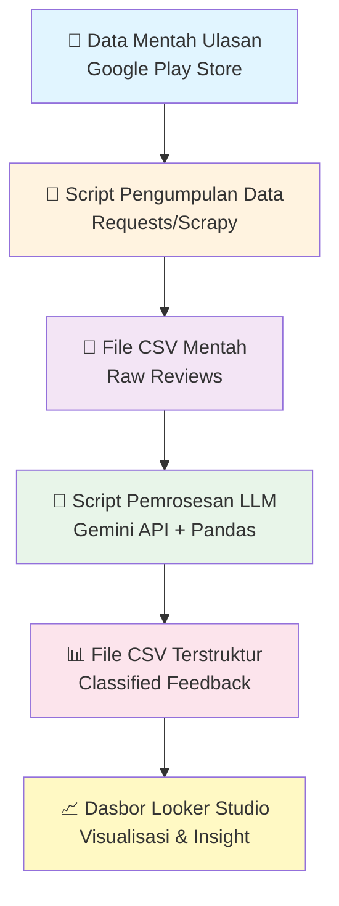

<div align="center">

# 🚀 Product Intelligence Engine (PI-Engine)

### *Transforming User Feedback into Actionable Product Insights*

[](https://www.python.org/)
[](https://ai.google.dev/)
[](https://lookerstudio.google.com/)
[](LICENSE)

</div>

---

## 📋 Latar Belakang

Tim produk sering menghadapi tantangan dalam mengidentifikasi inti dari keluhan pengguna dan memahami bagaimana posisi fitur produk mereka dibandingkan dengan para kompetitor. Tanpa sistem yang terstruktur, proses analisis ulasan menjadi manual, memakan waktu, dan rentan terhadap bias subjektif.

**PI-Engine** hadir sebagai solusi dengan membangun pipeline data otomatis yang mampu mengklasifikasikan umpan balik pengguna hingga ke akar masalahnya. Selain itu, sistem ini juga menyediakan dasbor visualisasi yang memudahkan tim untuk mengambil keputusan berbasis data secara cepat dan akurat.

---

## 🎯 Fitur Utama

✨ **Klasifikasi Otomatis** - Menggunakan LLM untuk mengkategorikan feedback pengguna  
📊 **Dashboard Interaktif** - Visualisasi insight dengan Looker Studio  
🔄 **Pipeline Terotomasi** - Proses ETL end-to-end tanpa intervensi manual  
🎯 **Analisis Kompetitor** - Bandingkan produk Anda dengan kompetitor  
📈 **Trend Analysis** - Identifikasi pola keluhan dari waktu ke waktu  

---

## 📊 Diagram Alur Sistem



### 🔄 Alur Kerja Pipeline

| Tahap | Deskripsi | Tools |
|-------|-----------|-------|
| **1. Data Collection** | Scraping ulasan dari Google Play Store | Requests/Scrapy |
| **2. Data Storage** | Menyimpan data mentah dalam format CSV | Pandas |
| **3. LLM Processing** | Klasifikasi dan analisis menggunakan AI | Gemini API |
| **4. Structured Output** | Data terstruktur dengan kategori keluhan | Pandas |
| **5. Visualization** | Dashboard interaktif untuk product insights | Looker Studio |

---

## 🛠️ Tech Stack

<table>
<tr>
<td>

**Backend & Processing**
- 🐍 Python 3.8+
- 🐼 Pandas
- 🌐 Requests/Scrapy
- 📊 Matplotlib/Seaborn

</td>
<td>

**AI & Visualization**
- 🤖 Google Gemini API
- 📈 Looker Studio
- 💾 CSV/JSON Storage
- 🔄 Automated ETL

</td>
</tr>
</table>

---

## 📈 Spesifikasi Data

| Parameter | Detail |
|-----------|--------|
| **Sumber Data** | Ulasan Google Play Store |
| **Objek Analisis** | MyUNNES |
| **Volume Data** | 800-1200 ulasan terbaru per aplikasi |
| **Update Frequency** | Otomatis/On-demand |

---

## 🚀 Cara Penggunaan

### 1️⃣ Clone Repository
```bash
git clone https://github.com/raindragon14/Product_Intellegence_Engine.git
cd Product_Intellegence_Engine
```

### 2️⃣ Install Dependencies
```bash
pip install -r requirements.txt
```

### 3️⃣ Setup API Key
```bash
# Tambahkan Gemini API key ke environment variable
export GEMINI_API_KEY="your-api-key-here"
```

### 4️⃣ Jalankan Pipeline
```bash
# Scraping data
python scraper.py

# Proses dengan LLM
python process_llm.py

# Generate visualisasi
python visualize.py
```

---

## 📁 Struktur Folder

```
Product_Intellegence_Engine/
├── data/
│   ├── raw/              # Data mentah dari scraping
│   └── processed/        # Data hasil pemrosesan LLM
├── scripts/
│   ├── scraper.py        # Script pengumpulan data
│   ├── process_llm.py    # Script pemrosesan LLM
│   └── visualize.py      # Script visualisasi
├── notebooks/            # Jupyter notebooks untuk eksplorasi
├── dashboard/            # File konfigurasi dashboard
├── requirements.txt      # Dependencies
└── README.md
```

---

## 📊 Output & Hasil

### Sample Dashboard
- 📌 **Top Complaints** - 10 keluhan teratas dari pengguna
- 📈 **Trend Analysis** - Perubahan sentimen dari waktu ke waktu
- 🎯 **Feature Comparison** - Benchmarking dengan kompetitor
- 🔍 **Root Cause Analysis** - Kategori masalah utama

---

## 🤝 Kontribusi

Kontribusi selalu terbuka! Silakan:
1. Fork repository ini
2. Buat branch fitur (`git checkout -b feature/AmazingFeature`)
3. Commit perubahan (`git commit -m 'Add some AmazingFeature'`)
4. Push ke branch (`git push origin feature/AmazingFeature`)
5. Buat Pull Request

---

## 📝 Lisensi

Project ini menggunakan lisensi MIT - lihat file [LICENSE](LICENSE) untuk detail.

---

## 👨‍💻 Author

**raindragon14**
- GitHub: [@raindragon14](https://github.com/raindragon14)

---

<div align="center">

### ⭐ Jika project ini bermanfaat, berikan bintang ya!

**Made with ❤️ for Better Product Decisions**

</div>
