<div align="center">

# 🚀 Product Intelligence Engine (PI-Engine)

### *Automated Review Analysis System with AI-Powered Insights*

[](https://www.python.org/)
[](https://ai.google.dev/)
[](https://lookerstudio.google.com/)
[](LICENSE)

**Transforming thousands of user reviews into actionable product insights in minutes**

[Quick Start](#-quick-start) • [Features](#-fitur-utama) • [Installation](#-installation) • [Documentation](#-documentation) • [Examples](#-example-output)

</div>

---

## 📋 Overview

Product Intelligence Engine (PI-Engine) adalah sistem otomatis untuk menganalisis review pengguna dari Google Play Store menggunakan AI. Sistem ini membantu product managers, developers, dan tim produk untuk:

- **Mengidentifikasi** pola keluhan dan masalah utama pengguna
- **Mengklasifikasikan** feedback ke dalam kategori yang actionable
- **Memprioritaskan** issue berdasarkan severity dan impact
- **Memvisualisasikan** insights dalam dashboard interaktif
- **Menghemat waktu** analisis manual dari hari menjadi menit

### 🎯 Why PI-Engine?

Manual review analysis memiliki beberapa kelemahan:
- ⏰ **Time-consuming** - Membaca ratusan/ribuan reviews memakan waktu
- 🎲 **Inconsistent** - Interpretasi subjektif antar reviewer
- 📊 **Limited Scale** - Sulit menganalisis volume besar
- 🔍 **Missing Patterns** - Trend tersembunyi tidak terdeteksi

**PI-Engine mengotomasi seluruh proses ini dengan AI.**

---

## ✨ Fitur Utama

### 🤖 AI-Powered Classification
- Automatic categorization menggunakan Google Gemini LLM
- Multi-level classification (Category → Subcategory)
- Sentiment analysis (Positive/Neutral/Negative)
- Priority scoring (High/Medium/Low) berdasarkan severity

### 📊 Comprehensive Analytics
- Rating distribution analysis
- Trend tracking over time
- Category-sentiment correlation
- High-priority issue detection

### 🎨 Rich Visualizations
- Auto-generated charts (PNG exports)
- Looker Studio integration
- Interactive dashboards
- Executive summary reports

### 🔄 Automated Pipeline
- One-command execution
- Batch processing support
- Error handling & retry logic
- Progress tracking dengan logs

### 🛠️ Production Ready
- Modular architecture
- Comprehensive error handling
- Extensive logging
- Sample data included
- Full documentation

---

## 🏗️ System Architecture

```mermaid
%%{init: {'theme':'base', 'themeVariables': { 'primaryColor':'#4CAF50','primaryTextColor':'#fff','primaryBorderColor':'#2E7D32','lineColor':'#1976D2','secondaryColor':'#2196F3','tertiaryColor':'#FF9800','background':'#ffffff','mainBkg':'#4CAF50','secondBkg':'#2196F3','tertiaryBkg':'#FF9800','textColor':'#333333','fontSize':'16px'}}}%%
graph TD
    A["📱 Data Mentah Ulasan<br/>Google Play Store"] --> B["🔧 Script Pengumpulan Data<br/>Requests/Scrapy"]
    B --> C["📄 File CSV Mentah<br/>Raw Reviews"]
    C --> D["🤖 Script Pemrosesan LLM<br/>Gemini API + Pandas"]
    D --> E["📊 File CSV Terstruktur<br/>Classified Feedback"]
    E --> F["📈 Dasbor Looker Studio<br/>Visualisasi & Insight"]
    
    style A fill:#1976D2,stroke:#0D47A1,stroke-width:2px,color:#fff
    style B fill:#FF6F00,stroke:#E65100,stroke-width:2px,color:#fff
    style C fill:#7B1FA2,stroke:#4A148C,stroke-width:2px,color:#fff
    style D fill:#2E7D32,stroke:#1B5E20,stroke-width:2px,color:#fff
    style E fill:#C2185B,stroke:#880E4F,stroke-width:2px,color:#fff
    style F fill:#F57C00,stroke:#E65100,stroke-width:2px,color:#fff
```




### Pipeline Stages

| Stage | Description | Output |
|-------|-------------|--------|
| **1. Data Collection** | Scrape reviews from Play Store | `reviews_*.csv` |
| **2. Data Validation** | Clean & validate data quality | Validated DataFrame |
| **3. LLM Processing** | AI classification & analysis | `processed_*.csv` |
| **4. Visualization** | Generate charts & dashboards | PNG files + Looker data |

---

## 🚀 Quick Start

### Prerequisites

- Python 3.9+ (tested on 3.13)
- Google Gemini API key ([Get free key](https://ai.google.dev/))
- Google Play Store app ID to analyze

### Installation

```bash
# Clone repository
git clone https://github.com/raindragon14/Product_Intellegence_Engine.git
cd Product_Intellegence_Engine

# Create virtual environment
python -m venv .venv
.\.venv\Scripts\activate  # Windows
# source .venv/bin/activate  # Linux/Mac

# Install dependencies
pip install -r requirements.txt
```

### Configuration

1. **Setup Environment Variables**

```bash
# Copy template
cp .env.example .env

# Edit .env file
GEMINI_API_KEY=your-api-key-here
APP_ID=com.your.app  # Google Play Store app ID
MAX_REVIEWS=1000
```

2. **Verify Installation**

```bash
python -c "import pandas, google.generativeai; print('OK')"
```

### Running the Pipeline

**Full Pipeline (Recommended)**
```bash
python main.py
```

**Step by Step**
```bash
# Step 1: Scrape reviews
python main.py --scrape-only

# Step 2: Process with AI
python main.py --process-only

# Step 3: Generate visualizations
python main.py --visualize-only
```

**Custom Parameters**
```bash
python main.py --app-id com.example.app --max-reviews 500
```

---

## 📁 Project Structure

```
Product_Intellegence_Engine/
├── config/                      # Configuration files
│   ├── config.py               # Central configuration
│   └── README.md               # Config documentation
│
├── data/
│   ├── raw/                    # Scraped reviews (auto-generated)
│   ├── processed/              # Classified data (auto-generated)
│   └── samples/                # Sample data for testing
│
├── scripts/                    # Core processing modules
│   ├── scraper.py             # Google Play Store scraper
│   ├── process_llm.py         # AI classification engine
│   └── visualize.py           # Chart generator
│
├── utils/                      # Utility functions
│   ├── data_handler.py        # Data operations
│   └── logger.py              # Logging utilities
│
├── notebooks/                  # Jupyter notebooks
│   └── data_exploration.ipynb # Data analysis
│
├── dashboard/                  # Dashboard resources
│   ├── exports/               # Generated charts (auto)
│   ├── looker_studio_guide.md # Setup guide
│   └── sample_dashboard_config.json
│
├── main.py                     # Main pipeline orchestrator
├── requirements.txt            # Python dependencies
├── .env.example               # Environment template
└── README.md                  # This file
```

---

## 📊 Example Output

### Console Output

```
=======================================================================
🚀 PRODUCT INTELLIGENCE ENGINE - FULL PIPELINE
=======================================================================
⏰ Started at: 2025-10-07 14:31:34

=======================================================================
📥 PHASE 1: DATA COLLECTION
=======================================================================
📱 Fetching app info for: com.whatsapp
✅ App: WhatsApp Messenger | Rating: 4.1 | Reviews: 140M+
🔍 Starting to scrape reviews (max: 1000)...
Scraping reviews: 100%|████████████████| 1000/1000
✅ Successfully scraped 1000 reviews
💾 Reviews saved to: data/raw/reviews_com.whatsapp_20251007.csv

=======================================================================
🤖 PHASE 2: LLM PROCESSING & CLASSIFICATION
=======================================================================
🤖 Processing 1000 reviews with LLM...
Classifying reviews: 100%|████████████| 1000/1000
✅ Classification completed!

📊 PROCESSING SUMMARY:
   Total reviews processed: 1000
   
   Category Distribution:
      Performance: 285
      UI/UX: 198
      Feature: 167
      Technical: 145
      Other: 205
      
   Sentiment Distribution:
      negative: 542 (54.2%)
      neutral: 258 (25.8%)
      positive: 200 (20.0%)
      
   Priority Distribution:
      high: 123 (12.3%)
      medium: 445 (44.5%)
      low: 432 (43.2%)

=======================================================================
🎨 PHASE 4: VISUALIZATION & DASHBOARD
=======================================================================
✅ Generated: category_distribution.png
✅ Generated: sentiment_analysis.png
✅ Generated: trend_analysis.png
✅ Generated: priority_distribution.png
💾 Exported for Looker Studio: looker_studio_data.csv

=======================================================================
✅ PIPELINE COMPLETED SUCCESSFULLY!
=======================================================================
⏱️  Duration: 342.5 seconds
📁 Raw Data: data/raw/reviews_com.whatsapp_20251007.csv
📁 Processed Data: data/processed/processed_reviews_20251007.csv
📊 Dashboard Exports: dashboard/exports/
```

### Generated Files

1. **Raw Data**: `data/raw/reviews_*.csv`
   - Unprocessed reviews from Play Store
   
2. **Processed Data**: `data/processed/processed_reviews_*.csv`
   - AI-classified with categories, sentiment, priority
   
3. **Visualizations**: `dashboard/exports/*.png`
   - Category distribution chart
   - Sentiment analysis chart
   - Trend over time chart
   - Priority distribution chart
   
4. **Dashboard Data**: `dashboard/exports/looker_studio_data.csv`
   - Ready for Looker Studio import

---

## 📚 Documentation

| Document | Description |
|----------|-------------|
| [QUICKSTART.md](QUICKSTART.md) | Step-by-step quick start guide |
| [INSTALL.md](INSTALL.md) | Detailed installation & troubleshooting |
| [TESTING.md](TESTING.md) | Testing guide with sample data |
| [dashboard/looker_studio_guide.md](dashboard/looker_studio_guide.md) | Complete Looker Studio setup |
| [config/README.md](config/README.md) | Configuration options |

---

## 🛠️ Technology Stack

| Component | Technology | Purpose |
|-----------|-----------|---------|
| **Language** | Python 3.9+ | Core development |
| **Web Scraping** | google-play-scraper | Review collection |
| **AI/LLM** | Google Gemini API | Text classification |
| **Data Processing** | Pandas, NumPy | Data manipulation |
| **Visualization** | Matplotlib, Seaborn | Chart generation |
| **Dashboard** | Looker Studio | Interactive dashboards |
| **Config** | python-dotenv | Environment management |
| **Progress** | tqdm | Progress bars |

---

## 🔧 Configuration

### Environment Variables (.env)

```env
# Required
GEMINI_API_KEY=your-gemini-api-key-here

# Optional
APP_ID=com.your.app
MAX_REVIEWS=1000
```

### Main Configuration (config/config.py)

```python
# Scraper settings
SCRAPER_CONFIG = {
    "app_id": "com.example.app",
    "max_reviews": 1000,
    "language": "id",  # Indonesian
    "country": "id",   # Indonesia
}

# LLM settings
LLM_CONFIG = {
    "model": "gemini-1.5-flash",
    "temperature": 0.3,  # Lower = more consistent
    "max_retries": 3,
}

# Classification categories
FEEDBACK_CATEGORIES = {
    "UI/UX": ["Design", "Navigation", "Accessibility"],
    "Performance": ["Speed", "Lag", "Crash"],
    "Feature": ["Missing", "Request", "Bug"],
    # ... more categories
}
```

---

## 📈 Use Cases

### For Product Managers
- Identify top user pain points
- Prioritize feature roadmap
- Track sentiment trends
- Compare with competitors

### For Developers
- Find critical bugs quickly
- Understand technical issues
- Track crash reports
- Monitor performance complaints

### For UX Designers
- Discover usability issues
- Understand user frustrations
- Validate design decisions
- Track UI-related feedback

### For Leadership
- Data-driven product decisions
- Executive summary reports
- ROI tracking
- Customer satisfaction metrics

---

## 🎯 Classification Schema

### Categories
- **UI/UX**: Design, Navigation, Accessibility, Layout
- **Performance**: Speed, Lag, Crash, Loading
- **Feature**: Missing Feature, Feature Request, Bug
- **Authentication**: Login, Registration, Password
- **Content**: Accuracy, Quality, Updates
- **Technical**: Bugs, Errors, Integration Issues
- **Other**: General Feedback, Praise, Questions

### Sentiment
- **Positive**: Praise, satisfaction
- **Neutral**: Informational, questions
- **Negative**: Complaints, issues

### Priority
- **High**: Crashes, critical bugs, security issues
- **Medium**: Annoying bugs, missing features
- **Low**: Minor issues, suggestions

---

## 🧪 Testing

### Test with Sample Data

```bash
# Copy sample data
cp data/samples/sample_reviews.csv data/raw/

# Run processing only (skips scraping)
python main.py --process-only
```

### Run All Tests

See [TESTING.md](TESTING.md) for comprehensive testing guide.

---

## 🤝 Contributing

We welcome contributions! Please follow these steps:

1. Fork the repository
2. Create a feature branch (`git checkout -b feature/AmazingFeature`)
3. Make your changes
4. Test thoroughly
5. Commit with clear messages (`git commit -m 'Add AmazingFeature'`)
6. Push to branch (`git push origin feature/AmazingFeature`)
7. Open a Pull Request

### Development Setup

```bash
# Clone your fork
git clone https://github.com/YOUR_USERNAME/Product_Intellegence_Engine.git
cd Product_Intellegence_Engine

# Install dev dependencies
pip install -r requirements.txt

# Make changes and test
python -m pytest  # If tests exist
```

---

## 📝 License

This project is licensed under the MIT License - see the [LICENSE](LICENSE) file for details.

### MIT License Summary
- ✅ Commercial use
- ✅ Modification
- ✅ Distribution
- ✅ Private use
- ❌ Liability
- ❌ Warranty

---

## 🐛 Troubleshooting

### Common Issues

**Issue**: `ModuleNotFoundError: No module named 'dotenv'`
- **Solution**: Activate virtual environment: `.\.venv\Scripts\activate`

**Issue**: `App not found (404)`
- **Solution**: Verify app ID is correct on Google Play Store

**Issue**: `API Key Error`
- **Solution**: Check `.env` file has correct `GEMINI_API_KEY`

**Issue**: Unicode/Emoji errors on Windows
- **Solution**: Already handled in code. If still occurs, run with UTF-8 encoding

**Issue**: Rate limiting
- **Solution**: Reduce `batch_size` in config or add delays

See [INSTALL.md](INSTALL.md) for detailed troubleshooting.

---

## 📊 Roadmap

### Current Features (v1.0)
- ✅ Google Play Store scraping
- ✅ AI-powered classification
- ✅ Sentiment analysis
- ✅ Priority scoring
- ✅ Visualization generation
- ✅ Looker Studio integration

### Planned Features (v2.0)
- [ ] Multi-platform support (iOS App Store, Web reviews)
- [ ] Competitor comparison analysis
- [ ] Automated scheduling & reports
- [ ] Email notifications
- [ ] REST API endpoints
- [ ] Web-based interface
- [ ] Real-time monitoring
- [ ] Multi-language support
- [ ] Custom ML model training

---

## 💬 Support

- 📖 **Documentation**: See `/docs` folder and linked guides
- 🐛 **Bug Reports**: [Open an issue](https://github.com/raindragon14/Product_Intellegence_Engine/issues)
- 💡 **Feature Requests**: [Discussions](https://github.com/raindragon14/Product_Intellegence_Engine/discussions)
- 📧 **Contact**: Create an issue for support

---

## 🙏 Acknowledgments

- **Google Gemini API** for powerful LLM capabilities
- **google-play-scraper** library for reliable scraping
- **Looker Studio** for excellent visualization platform
- Open source community for amazing tools

---

## 👨‍💻 Author

**raindragon14**
- GitHub: [@raindragon14](https://github.com/raindragon14)
- Project: [Product Intelligence Engine](https://github.com/raindragon14/Product_Intellegence_Engine)

---

## ⭐ Star History

If you find this project useful, please consider giving it a star! It helps others discover the project.

---

## 📄 Citation

If you use this project in your research or work, please cite:

```bibtex
@software{pi_engine_2025,
  author = {raindragon14},
  title = {Product Intelligence Engine: AI-Powered Review Analysis},
  year = {2025},
  url = {https://github.com/raindragon14/Product_Intellegence_Engine}
}
```

---

<div align="center">

**Made with ❤️ for Better Product Decisions**

[⬆ Back to Top](#-product-intelligence-engine-pi-engine)

</div>
